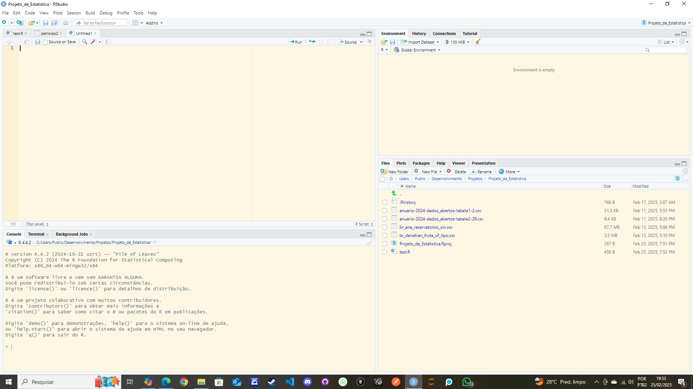

```{r setup, include=FALSE}
knitr::opts_chunk$set(echo = TRUE)
tinytex::install_tinytex(force = TRUE)
```

### 1 - Plataforma RStudio instalada localmente


### 2 - Escolha uma base de dados e justificativa
A base escolhida foi a de frota veicular do Brasil nos últimos 20 anos, separada pela unidade da federação e tipo de veículo. 
Analisando os dados ao longo de duas décadas, é possível identificar tendências e mudanças significativas no uso e na distribuição dos veículos no Brasil. Isso pode revelar padrões de crescimento ou declínio em diferentes tipos de veículos e nas diversas unidades da federação.
Esses dados são cruciais para a formulação de políticas públicas. Informações detalhadas sobre a frota veicular ajudam governos locais e federais a tomar decisões informadas sobre infraestrutura, transporte público, leis de trânsito e outras áreas relacionadas.
O tipo e o número de veículos em circulação afetam diretamente o meio ambiente. Compreender essas mudanças pode auxiliar na criação de políticas ambientais, como incentivos para veículos elétricos ou híbridos, e outras medidas para reduzir a emissão de poluentes.
A análise pode fornecer insights valiosos para a indústria automobilística, desde fabricantes até concessionárias. Compreender as preferências regionais e as mudanças ao longo do tempo pode ajudar no planejamento de produção e marketing.
Ao analisar os tipos de veículos e suas distribuições, é possível desenvolver estratégias para melhorar a segurança no trânsito. Diferentes tipos de veículos podem estar associados a diferentes níveis de risco, e essa informação é vital para a implementação de medidas preventivas.
Pesquisadores acadêmicos podem usar esses dados para conduzir estudos detalhados em áreas como economia, sociologia, urbanismo e meio ambiente, contribuindo para o avanço do conhecimento.

### 3 - Explique qual o motivo para a escolha dessa base e explique os resultados esperados através da análise.


### 4 - Carregue a base para o RStudio e comprove o carregamento tirando um print da tela com a base escolhida presente na área "Ambiente"/Enviroment. Detalhe como você realizou o carregamento dos dados.
### 5 - Instale e carregue os pacotes de R necessários para sua análise (mostre o código necessário):
tidyverse
ggplot
summarytools
### 6 - Escolha outros pacotes necessários, aponte sua necessidade e instale e carregue (mostrando o código necessário).
### 7 - Aplique uma função em R que seja útil para sua análise e mostre.
### 8 - Escolha uma variável de seu banco de dados e calcule:
a média para todos os eventos
o desvio padrão
os quantis: 25% e 75%
### 9 - Utilizando o pacote summarytools (função descr), descreva estatisticamente a sua base de dados.
### 10 - Escolha uma variável e crie um histograma. Justifique o número de bins usados. A distribuição dessa variável se aproxima de uma "normal"? Justifique.
### 11 - Calcule a correlação entre todas as variáveis dessa base. Quais são as 3 pares de variáveis mais correlacionadas?
### 12 - Crie um scatterplot entre duas variáveis das resposta anterior. Qual a relação da imagem com a correlação entre as variáveis.
### 13 - Crie um gráfico linha de duas das variáveis. Acrescente uma legenda e rótulos nos eixos.

Assim que terminar, salve o seu arquivo PDF e poste no Moodle. Utilize o seu nome para nomear o arquivo, identificando também a disciplina no seguinte formato: “nomedoaluno_nomedadisciplina_pd.PDF”.


## R Markdown

This is an R Markdown document. Markdown is a simple formatting syntax for authoring HTML, PDF, and MS Word documents. For more details on using R Markdown see <http://rmarkdown.rstudio.com>.

When you click the **Knit** button a document will be generated that includes both content as well as the output of any embedded R code chunks within the document. You can embed an R code chunk like this:

```{r cars}
summary(cars)
```

## Including Plots

You can also embed plots, for example:

```{r pressure, echo=FALSE}
plot(pressure)
```

Note that the `echo = FALSE` parameter was added to the code chunk to prevent printing of the R code that generated the plot.
