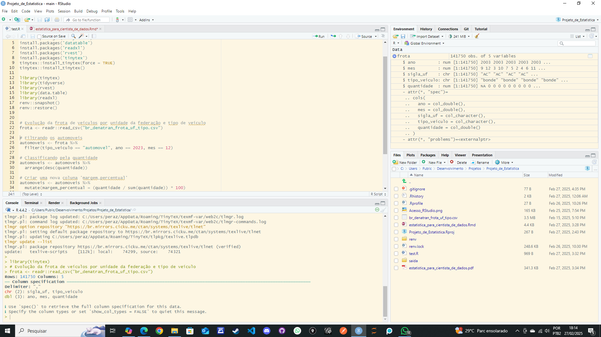

```{r setup, include=FALSE}
knitr::opts_chunk$set(echo = TRUE)
tinytex::install_tinytex(force = TRUE)
options(scipen = 999)
```

### 1 - Plataforma RStudio instalada localmente


### 2 - Escolha uma base de dados e justificativa
Foi escolhida a base sobre a frota veicular do Brasil no período de 2003 até 2023, obtida no link https://basedosdados.org/dataset/61d592ca-5aec-4f66-b8eb-f7b894a29b66?table=75489368-064f-4de3-a6dc-20ba4d0fe7bf, onde a quantidade de veículos está separada por tipo de veículo e unidade da federação.

### 3 - Explique qual o motivo para a escolha dessa base e explique os resultados esperados através da análise.

Analisando os dados ao longo de duas décadas, é possível identificar tendências e mudanças significativas no uso e na distribuição dos veículos no Brasil. Isso pode revelar padrões de crescimento ou declínio em diferentes tipos de veículos e nas diversas unidades da federação.
Esses dados são cruciais para a formulação de políticas públicas. Informações detalhadas sobre a frota veicular ajudam governos locais e federais a tomar decisões informadas sobre infraestrutura, transporte público, leis de trânsito e outras áreas relacionadas.
O tipo e o número de veículos em circulação afetam diretamente o meio ambiente. Compreender essas mudanças pode auxiliar na criação de políticas ambientais, como incentivos para veículos elétricos ou híbridos, e outras medidas para reduzir a emissão de poluentes.
A análise pode fornecer insights valiosos para a indústria automobilística, desde fabricantes até concessionárias. Compreender as preferências regionais e as mudanças ao longo do tempo pode ajudar no planejamento de produção e marketing.
Ao analisar os tipos de veículos e suas distribuições, é possível desenvolver estratégias para melhorar a segurança no trânsito. Diferentes tipos de veículos podem estar associados a diferentes níveis de risco, e essa informação é vital para a implementação de medidas preventivas.
Pesquisadores acadêmicos podem usar esses dados para conduzir estudos detalhados em áreas como economia, sociologia, urbanismo e meio ambiente, contribuindo para o avanço do conhecimento.
A ideia inicial é de analisar a frota de automóveis, motocicletas e caminhões do estado de São Paulo durante os 20 anos da base, de 2003 até 2023. O resultado esperado seria uma maior participação das motocicletas na frota, em função da maior lentidão ao se locomover dos automóveis por conta dos congestionamentos que acontecem com uma frequência alta, principalmente na Grande São Paulo. Teoricamente, a motocicleta se mostraria mais eficiente nesse cenário.

### 4 - Carregue a base para o RStudio e comprove o carregamento tirando um print da tela com a base escolhida presente na área "Ambiente"/Enviroment. Detalhe como você realizou o carregamento dos dados.

```{r Carregamento da base da frota de veículos, echo=TRUE}
frota <- readr::read_csv("br_denatran_frota_uf_tipo.csv")
```



### 5 - Instale e carregue os pacotes de R necessários para sua análise (mostre o código necessário):

```{r instalando pacotes, echo=TRUE}
install.packages('tidyverse')
install.packages('ggplot2')
install.packages('summarytools')
```

```{r importando bibliotecas, echo = TRUE}
library(tidyverse)
library(ggplot2)
library(summarytools)
```

### 6 - Escolha outros pacotes necessários, aponte sua necessidade e instale e carregue (mostrando o código necessário).

```{r instalando outros pacotes, echo=TRUE}
install.packages('dlookr')
install.packages('readxl')
install.packages('knitr')
install.packages('scales')
install.packages('dplyr')
```

```{r importando outras bibliotecas, echo = TRUE}
library(dlookr)
library(readxl)
library(knitr)
library(scales)
library(dplyr)
```

```{r frota, echo=FALSE}
kable(head(frota))
```

### 7 - Aplique uma função em R que seja útil para sua análise e mostre.

```{r Frota do estado de São Paulo, echo=TRUE}
frota_sp <- frota %>%
  filter(mes == 12, sigla_uf == "SP") %>%
  select(-mes, -sigla_uf)
```

```{r frota de SP, echo=FALSE}
kable(head(frota_sp))
```

```{r Frota ajustada, echo=TRUE}
frota_sp_ajustada <- frota_sp %>%
  mutate(
    automoveis = ifelse(tipo_veiculo == "automovel", quantidade, 0),
    motocicletas = ifelse(tipo_veiculo %in% c("motocicleta", "motoneta"), quantidade, 0),
    caminhoes = ifelse(tipo_veiculo %in% c("caminhao", "caminhonete", "caminhoneta"), quantidade, 0)
  ) %>%
  select(ano, automoveis, motocicletas, caminhoes) %>%
  group_by(ano) %>%
  summarise(
    automoveis = sum(automoveis),
    motocicletas = sum(motocicletas),
    caminhoes = sum(caminhoes)
  )
```

```{r frota de SP ajustada , echo=FALSE}
kable(head(frota_sp_ajustada))
```

```{r Gráfico da frota de automóveis, motocicletas e caminhões, echo=FALSE}
frota_sp_long <- frota_sp_ajustada %>%
  pivot_longer(cols = c(automoveis, motocicletas, caminhoes), 
               names_to = "tipo_veiculo", 
               values_to = "quantidade")


ggplot(frota_sp_long, aes(x = ano, y = quantidade, color = tipo_veiculo)) +
  geom_line() +
  geom_point() +
  labs(title = "Frota de Veículos por tipo",
       x = "Ano",
       y = "Frota de Veículos",
       color = "Tipo de Veículo") +
  scale_y_continuous(labels = scales::comma) +
  theme_minimal()
```

### 8 - Escolha uma variável de seu banco de dados e calcule

```{r desc variavel automóveis com summarise, echo = TRUE}
estatisticas <- frota_sp_ajustada %>%
  summarise(
    Média = mean(motocicletas, na.rm = TRUE),
    `Desvio Padrão` = sd(motocicletas, na.rm = TRUE),
    `Quantil 25%` = quantile(motocicletas, probs = 0.25, na.rm = TRUE),
    `Quantil 75%` = quantile(motocicletas, probs = 0.75, na.rm = TRUE)
  )

kable(estatisticas, format = "markdown", digits = 2, 
      caption = "Estatísticas Descritivas para Motocicletas")
```

### 9 - Utilizando o pacote summarytools (função descr), descreva estatisticamente a sua base de dados.

```{r desc variavel automóveis, echo = TRUE}
frota_sp_ajustada %>% dplyr::select(automoveis) %>% summarytools::descr(., style = 'rmarkdown') %>% kable()
```

```{r desc variavel motocicletas, echo = TRUE}
frota_sp_ajustada %>% dplyr::select(motocicletas) %>% summarytools::descr(., style = 'rmarkdown') %>% kable()
```

```{r desc variavel caminhões, echo = TRUE}
frota_sp_ajustada %>% dplyr::select(caminhoes) %>% summarytools::descr(., style = 'rmarkdown') %>% kable()
```

### 10 - Escolha uma variável e crie um histograma. Justifique o número de bins usados. A distribuição dessa variável se aproxima de uma "normal"? Justifique.


### 11 - Calcule a correlação entre todas as variáveis dessa base. Quais são as 3 pares de variáveis mais correlacionadas?
### 12 - Crie um scatterplot entre duas variáveis das resposta anterior. Qual a relação da imagem com a correlação entre as variáveis.
### 13 - Crie um gráfico linha de duas das variáveis. Acrescente uma legenda e rótulos nos eixos.

Assim que terminar, salve o seu arquivo PDF e poste no Moodle. Utilize o seu nome para nomear o arquivo, identificando também a disciplina no seguinte formato: “nomedoaluno_nomedadisciplina_pd.PDF”.


